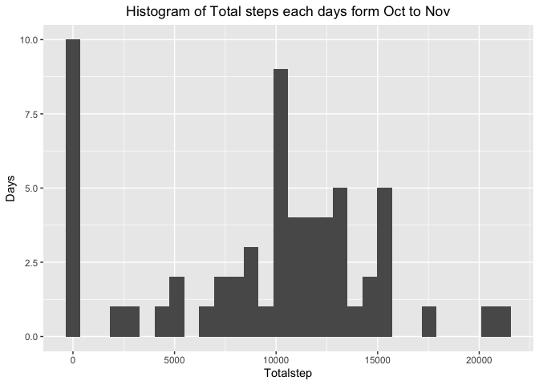
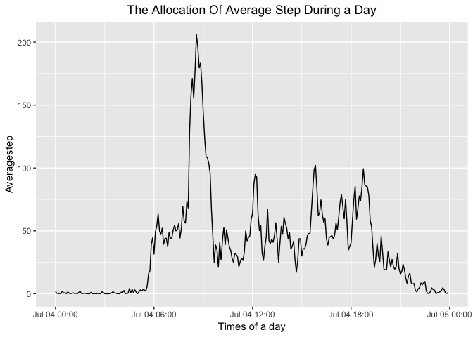

## Setting global options and loading packages

```r
library(knitr)
library(dplyr)
library(ggplot2)
library(lubridate)
library(data.table)
opts_chunk$set(cache = FALSE, message = FALSE)
```
* Turn off *cache* and *message* in global option   
* Load package:  
  + kinitr  
  + dplyr  
  + ggplot2  
  + libridate  
  + data.table  

## Loading and preprocessing the data

```r
data <- read.csv("activity.csv", header = TRUE, )
```


## What is mean total number of steps taken per day?
for this part of the analysis, I temporary ignore the NA value of the step column


This is how I calculate the total steps each day

```r
groupeddata <- group_by(data, date) %>% 
  summarise(Totalstep = sum(steps, na.rm = TRUE))
```

> * The Mean of the Total step is 9354.2295082.
  * The Median of the Total step is 10395. 

Ploting the total each day by histogram to see the distribution of steps in 2 months


```r
groupeddata$date <- as.Date(groupeddata$date)
ggplot(data = groupeddata, aes(x= Totalstep)) + 
  geom_histogram() +
  labs(title = "Histogram of Total steps each days form Oct to Nov") +
  theme(plot.title = element_text(hjust=0.5))
```

<!-- -->

> * We can see that there are more than 10 days of missing value 
  * the density is discrete in some value
  * It can easily infer that the Total step each date follow the *Normal Distribution*

## What is the average daily activity pattern?

Before ploting time series line chart by 5-minute of step, I have to add one more columns of Time data with the interval of increment of 5-minutes. Then I add its to the original dataset. I also add one more interval columns as the Time format (HH:MM:SS)

```r
Time <- seq.POSIXt(from = as.POSIXct(ymd_hms("2012-10-01 00:00:01")),to = as.POSIXct(ymd_hms("2012-11-30 23:55:01")), by = "5 min")
data <- cbind(data, Time)
data$intervaltime <- as.ITime(data$Time)
```

calculating the average numbers of step by each interval  

```r
groupave <- group_by(data, intervaltime) %>% summarise(Averagestep = mean(steps, na.rm = TRUE))
```

Ploting the time series based on the 5-minute time series

```r
ggplot(groupave, aes(x =as.POSIXct(groupave$intervaltime, format = "%H:%M:%S"), y = Averagestep)) +
  geom_line() +
  labs(x = "Times of a day", title = "The Allocation Of Average Step During a Day") +
  theme(plot.title = element_text(hjust = 0.5))
```

<!-- -->

Time of a day which have maximum average step 

```r
subset(groupave, groupave$Averagestep == max(groupave$Averagestep))
```

```
## # A tibble: 1 x 2
##   intervaltime Averagestep
##   <ITime>            <dbl>
## 1 08:35:01            206.
```

> * It can be seen that the walking activity often occure at late morning and early noon
  * More specifically, the largest amount of step occured at **08:35:01**

## Imputing missing values


## Are there differences in activity patterns between weekdays and weekends?
